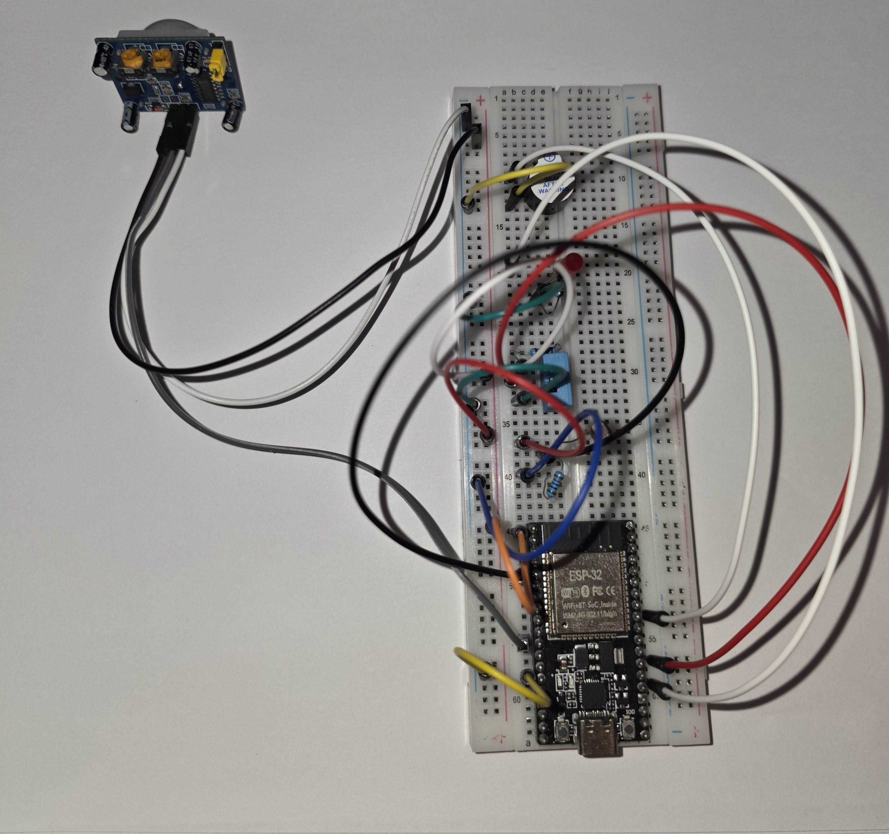
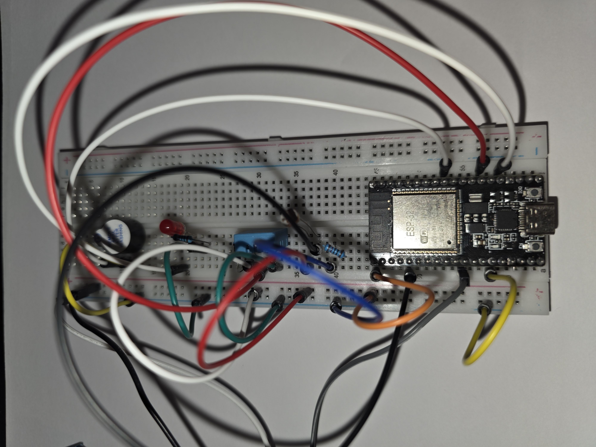
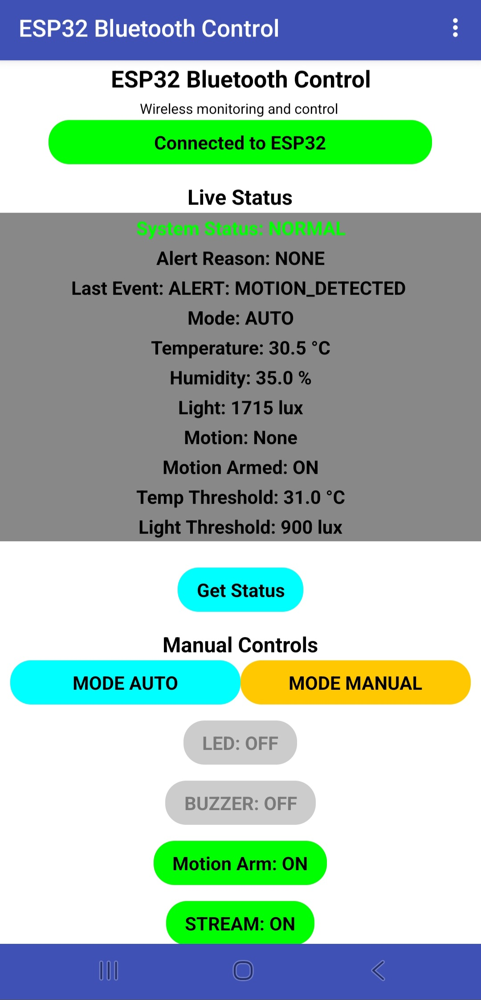
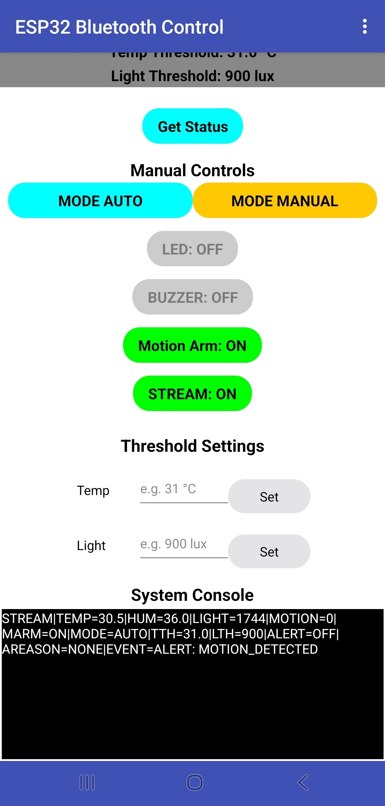
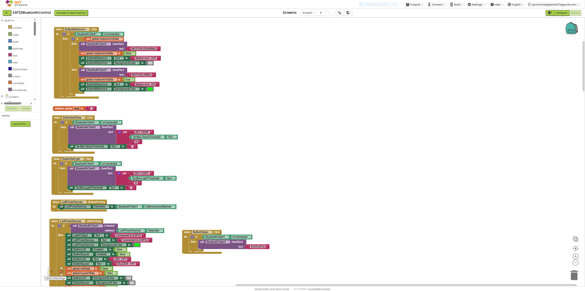
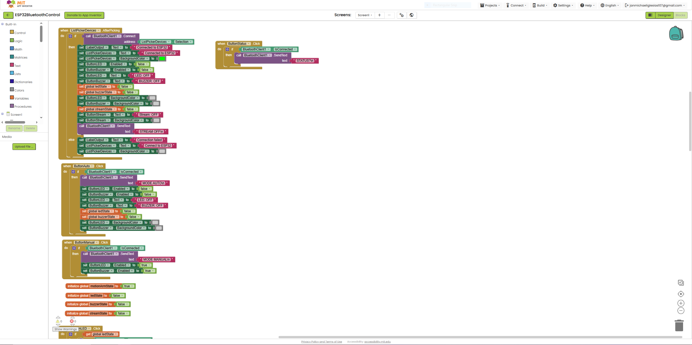
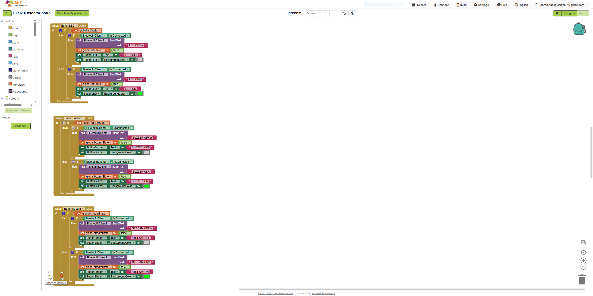
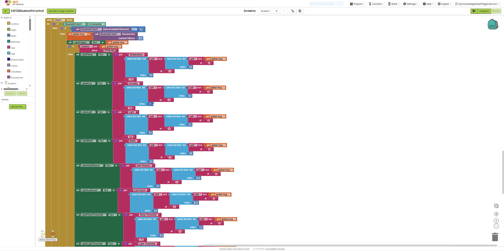
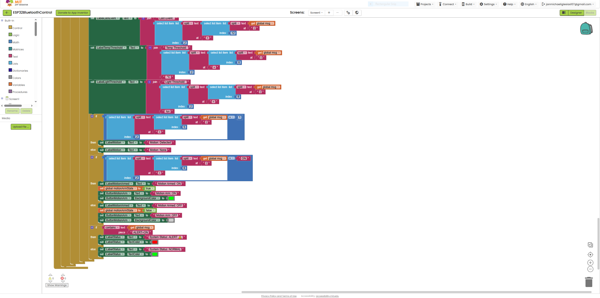

# ESP32 Bluetooth Smart Monitoring & Control System

## Overview
This project is a Bluetooth-based embedded system built on the ESP32 that enables real-time environmental monitoring and mobile-based control through a custom Android application.

The system integrates multiple sensors and implements bidirectional communication for live data streaming, user control, and intelligent alert handling.

---

## Key Features
- Real-time monitoring of temperature, humidity, light, and motion
- Bluetooth communication between ESP32 and Android application
- Bidirectional protocol for command execution and data streaming
- AUTO and MANUAL operating modes
- Motion arming and disarming functionality
- User-configurable temperature and light thresholds
- Multi-condition alert detection (sensor + motion)
- Persistent alert tracking for last triggered event

---

## System Architecture

```text
Sensors -> ESP32 -> Bluetooth -> Mobile App
                       |
                       v
                 Alert Logic -> LED + Buzzer
                       ^
                       |
               User Commands (App)

---

## Hardware Components
- ESP32 Development Board
- DHT11 Temperature & Humidity Sensor
- Photoresistor (LDR)
- PIR Motion Sensor
- LED
- Active Buzzer
- Breadboard and jumper wires

---

## Software Stack
- Arduino IDE (ESP32 firmware)
- MIT App Inventor (Android app)
- BluetoothSerial library

---

## How It Works
1. Sensors collect environmental data (temperature, humidity, light, motion)
2. ESP32 processes incoming data and evaluates threshold conditions
3. Alert logic determines system state based on multiple inputs
4. Data is transmitted to the mobile app via Bluetooth
5. The user can:
   - toggle devices (LED, buzzer)
   - enable/disable streaming
   - adjust thresholds
   - switch between AUTO and MANUAL modes
6. The system maintains the last alert event for user visibility

---

## Hardware Setup



---

## Mobile App Interface



---

## Application Logic (MIT App Inventor)






---

## Technical Highlights
- Designed a custom Bluetooth communication protocol for reliable command and data exchange
- Implemented real-time state management between embedded system and mobile application
- Integrated multi-sensor input with event-driven alert logic
- Ensured synchronization between UI state and hardware behavior
- Developed a responsive mobile interface with live system feedback

---

## Future Improvements
- Cloud integration for remote monitoring
- Data logging and historical analytics
- PCB design for compact hardware implementation
- Mobile app UI enhancements and notifications
